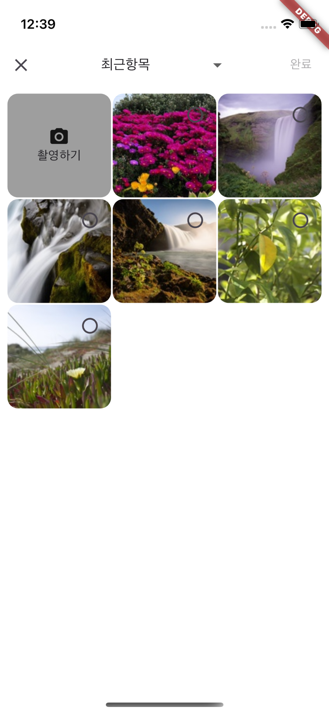
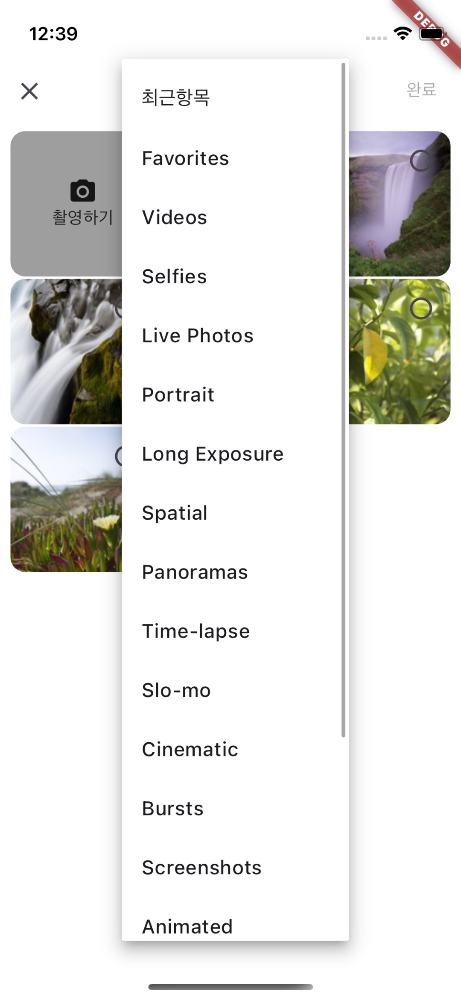
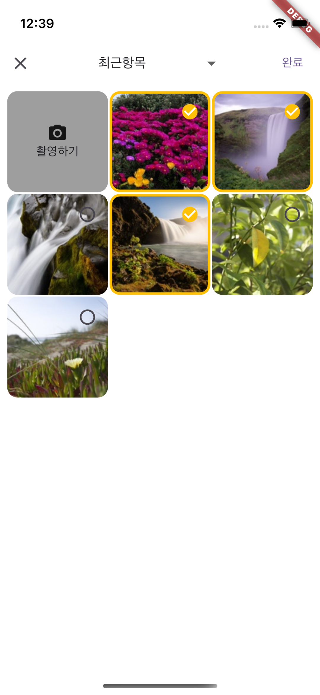
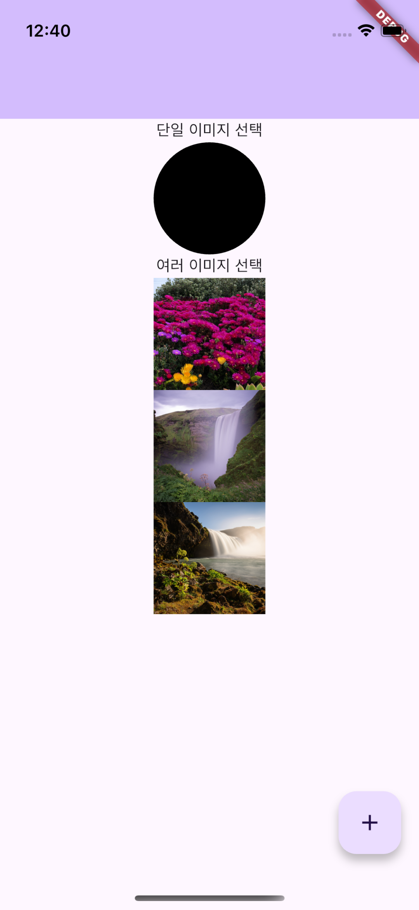

# 이미지 선택 처리
이 프로젝트는 Flutter에서 photo_manager 및 image_picker 패키지를 사용하여 갤러리 및 카메라에서 이미지를 선택하는 기능을 구현합니다.

## 🛠 사용한 패키지
1. photo_manager: ^3.6.4 : https://pub.dev/packages/photo_manager
2. photo_manager_image_provider: ^2.2.0 : https://pub.dev/packages/photo_manager_image_provider
3. permission_handler: ^11.4.0 : https://pub.dev/packages/permission_handler
4. device_info_plus: ^11.3.0 : https://pub.dev/packages/device_info_plus
5. image_picker: ^1.1.2 : https://pub.dev/packages/image_picker


## 📌 기능
- 갤러리에서 이미지 선택 (여러 개의 이미지 선택 지원)
- 카메라로 사진 촬영 후 선택
- 선택된 이미지 표시

## 🔐 권한 설정
### android
- AndroidManifest.xml
```xml
<manifest xmlns:android="http://schemas.android.com/apk/res/android">
    <!-- 카메라 권한 -->
    <uses-permission android:name="android.permission.CAMERA"/>
    <!-- Devices running Android (API level 33) or higher -->
    <uses-permission android:name="android.permission.READ_EXTERNAL_STORAGE"/>
    <!-- Devices running Android 12L (API level 32) or lower  -->
    <uses-permission android:name="android.permission.READ_MEDIA_IMAGES" />

    <uses-feature android:name="android.hardware.camera" android:required="false"/>
```
### ios
- info.plist
```
<key>NSCameraUsageDescription</key>
<string>카메라 권한 허용을 해주세요</string>
<key>NSPhotoLibraryUsageDescription</key>
<string>포토 라이브러리 권한을 허용해주세요.</string>
```

### flutter code
```dart
abstract class PermissionUtils {
  // 카메라 권한 체크
  static Future<bool> checkCameraPermission(BuildContext context, bool mounted) async {
    final cameraPermissionStatus = await Permission.camera.request();
    if (!mounted) return false;

    if (cameraPermissionStatus.isGranted) {
      return true;
    } else {
      return false;
    }
  }

  // 갤러리 권한 체크
  static Future<bool> checkGalleryPermission(BuildContext context, bool mounted) async {
    // 최초 권한 요청 후 권한 상태 값 반환
    final galleryPermissionStatus = Platform.isAndroid ? await checkAndroidPermission() : await Permission.photos.request();
    if (!mounted) return false;

    if(galleryPermissionStatus.isGranted) {
      return true;
    } else {
      return false;
    }

  }

  static Future<PermissionStatus> checkAndroidPermission() async {
    DeviceInfoPlugin plugin = DeviceInfoPlugin();
    AndroidDeviceInfo android = await plugin.androidInfo;
    if (android.version.sdkInt < 33) {
      return await Permission.storage.request();
    } else {
      return await Permission.photos.request();
    }
  }
}
```

## 📜 코드 설명
### PhotoPickerModal 파라미터
```dart
  final MediaQueryData mediaQuery;
  final bool multiSelect;
  final Function(List<File>) onSelectImages;
```
- mediaQuery : 기기 화면 크기 및 스케일 정보를 포함한 MediaQuery 데이터를 전달받는 파라미터
- multiSelect : 여러 이미지를 선택할 수 있는지 여부를 결정하는 파라미터 (true이면 다중 선택 가능)
- onSelectImages : 이미지 선택 후 선택된 이미지를 반환하는 콜백 함수. 선택된 이미지는 List<File> 형태로 전달됨

### PhotoPickerModal 변수
```dart
  List<AssetEntity> _imageList = [];
  List<AssetEntity> _selectedImageList = [];
  List<AssetPathEntity> _albumList = [];
  AssetPathEntity? _selectedAlbum;

  int _currentPage = 0;
  final int _pageSize = 30;
```
- _imageList : 불러온 이미지 목록
- _selectedImageList : 선택한 이미지 목록
- _albumList : 불러온 앨범 목록
- _selectedAlbum : 선택한 앨범
- _currentPage : 불러온 이미지 목록의 페이지 번호
- _pageSize : 불러오는 이미지 개수

### 앨범 목록 불러오기
```dart
  Future<void> _loadAlbumList() async {
    final fetchedAlbumList =
        await PhotoManager.getAssetPathList(type: RequestType.image);

    if (fetchedAlbumList.isEmpty) return;

    setState(() {
      _albumList = fetchedAlbumList;
      _selectedAlbum = _albumList.first;
    });
    _loadImageList(_selectedAlbum!, albumChanged: true);
  }
```
- PhotoManager.getAssetPathList : 앨범 목록 불러오기

### 이미지 목록 불러오기
```dart
  Future<void> _loadImageList(AssetPathEntity album,
      {bool albumChanged = false}) async {
    if (albumChanged) {
      _isRefresh = true;
      _currentPage = 0;
    } else {
      // 앨범 변경을 안한 경우는 스크롤을 내려서 불러오는 경우
      final totalImagesCount = await album.assetCountAsync;
      if (_imageList.length == totalImagesCount) {
        return;
      }
    }

    final assets =
        await album.getAssetListPaged(page: _currentPage, size: _pageSize);

    setState(() {
      if (albumChanged) {
        _imageList = assets;
      } else {
        _imageList.addAll(assets);
      }
      _currentPage++;
      _isRefresh = false;
    });
  }
```
- AssetPathEntity album : 선택한 앨범
- bool albumChanged : 앨범 변경 여부 (true : 앨범 선택, false : 스크롤 내려서 페이지 변경)
- album.getAssetListPaged(page: _currentPage, size: _pageSize) : 해당 앨범의 이미지 불러오기

### 스크롤 리스너
```dart
  void _scrollListener() {
    if (_scrollController.position.pixels ==
        _scrollController.position.maxScrollExtent) {
      if (_selectedAlbum == null) return;
      _loadImageList(_selectedAlbum!);
    }
  }
```
- 화면의 아래에 도달했을 때 다음 페이지의 이미지 불러오기

### 사진 촬영 선택
```dart
  void _onCameraTap() async {
    final picker = ImagePicker();
    final pickedFile = await picker.pickImage(source: ImageSource.camera);

    if (pickedFile != null) {
      widget.onSelectImages.call([File(pickedFile.path)]);
      Navigator.of(context).pop();
    }
  }
```
- 사진 촬영한 경우는 여러 개의 이미지 선택 불가

### 이미지 선택
```dart
  void _onImageTap(AssetEntity image) {
    if (widget.multiSelect) {
      setState(() {
        _selectedImageList.contains(image)
            ? _selectedImageList.remove(image)
            : _selectedImageList.add(image);
      });
    } else {
      setState(() {
        _selectedImageList.contains(image)
            ? _selectedImageList.remove(image)
            : _selectedImageList = [image];
      });
    }
  }
```
- PhotoPickerModal에서 파라미터로 받은 multiSelect로 싱글, 멀티 구분

### 이미지 선택 완료
```dart
  void _onComplete() async {
    List<File> imageFiles = [];
    for (var image in _selectedImageList) {
      final file = await image.file;
      if (file != null) {
        imageFiles.add(file);
      }
    }
    widget.onSelectImages.call(imageFiles);

    Navigator.of(context).pop();
  }
```

## 🖼️ 화면 구현
### 사진 선택 화면




### 선택한 사진 처리 화면

